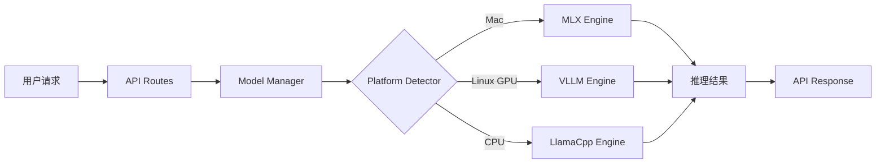

# 📁 VLLM 跨平台推理服务 - 项目结构

## 🏗️ 项目目录结构

```
vllm-obtain/
│
├── 📂 src/                              # 核心源代码
│   ├── 📂 api/                          # Web API 层
│   │   ├── __init__.py
│   │   ├── app.py                       # Flask 应用主体 (WSGI应用)
│   │   ├── load_balanced_app.py         # 负载均衡应用
│   │   └── 📂 routes/                   # API 路由
│   │       ├── __init__.py
│   │       ├── openai_compat.py         # OpenAI 兼容接口 ⭐
│   │       ├── management.py            # 管理和监控接口
│   │       └── load_balanced.py         # 负载均衡路由
│   │
│   ├── 📂 core/                         # 核心业务逻辑
│   │   ├── __init__.py
│   │   ├── inference_engine.py          # 推理引擎抽象基类
│   │   ├── model_manager.py             # 模型生命周期管理 ⭐
│   │   ├── load_balancer.py             # 负载均衡器
│   │   └── exceptions.py                # 自定义异常
│   │
│   ├── 📂 engines/                      # 推理引擎实现
│   │   ├── __init__.py
│   │   ├── mlx_engine.py                # MLX 引擎 (Apple Silicon) 🍎
│   │   ├── vllm_engine.py               # VLLM 引擎 (NVIDIA/AMD GPU) 🚀
│   │   └── llamacpp_engine.py           # LlamaCpp 引擎 (CPU通用) 💻
│   │
│   └── 📂 utils/                        # 工具模块
│       ├── __init__.py
│       ├── config.py                    # 配置管理器
│       ├── logger.py                    # 日志系统
│       ├── platform_detector.py         # 平台自动检测 ⭐
│       └── cluster_manager.py           # 集群管理
│
├── 📂 scripts/                          # 脚本和工具
│   ├── 📂 tests/                        # 功能测试脚本
│   │   ├── test_inference.py            # 推理测试
│   │   ├── test_inference_fixed.py      # 修复后的推理测试
│   │   ├── test_openai_compatibility.py # OpenAI 兼容性测试 ⭐
│   │   ├── test_platform_detection.py   # 平台检测测试
│   │   ├── test_server.py               # 服务器测试
│   │   ├── simple_test.py               # 简单测试
│   │   └── final_verification_test.py   # 最终验证测试
│   │
│   └── 📂 benchmarks/                   # 性能基准测试
│       ├── concurrent_test.py           # 并发性能测试 ⭐
│       ├── comprehensive_test.py        # 综合性能测试
│       ├── serial_stress_test.py        # 串行压力测试
│       └── stress_test.py               # 压力测试
│
├── 📂 tests/                            # 单元测试 (pytest)
│   ├── conftest.py                      # pytest 配置
│   ├── test_utils.py                    # 测试工具
│   ├── 📂 unit/                         # 单元测试
│   │   └── test_platform_detector.py    # 平台检测单元测试
│   ├── 📂 integration/                  # 集成测试
│   │   └── test_api_compatibility.py    # API 兼容性集成测试
│   └── 📂 performance/                  # 性能测试
│       └── test_performance.py          # 性能基准测试
│
├── 📂 models/                           # 模型文件存储
│   └── 📂 qwen-0.5b/                    # Qwen2.5-0.5B-Instruct 模型
│       ├── config.json                  # 模型配置
│       ├── tokenizer.json               # 分词器
│       ├── model.safetensors            # 模型权重
│       └── README.md                    # 模型说明
│
├── 📂 docs/                             # 项目文档
│   ├── README_PRODUCTION.md             # 生产部署指南
│   ├── PROJECT_STRUCTURE.md             # 项目结构说明
│   ├── Mac_Studio_完整测试报告_*.md      # Mac Studio 测试报告 ⭐
│   ├── 测试报告.md                       # 通用测试报告
│   ├── 测试和性能文档.md                  # 性能测试文档
│   ├── 开发文档.md                       # 开发指南
│   ├── 开发计划进度.md                    # 开发进度跟踪
│   ├── 使用指南.md                       # 用户使用指南
│   └── 生产mac测试报告.md                 # Mac 生产环境报告
│
├── 📂 config/                           # 配置文件
│   ├── .env.example                     # 环境变量模板
│   ├── .env.mac                         # macOS 专用配置 🍎
│   ├── .env.linux                       # Linux 专用配置 🐧
│   └── .env.windows                     # Windows 专用配置 🪟
│
├── 📂 logs/                             # 日志文件 (运行时生成)
│   ├── app.log                          # 应用日志
│   ├── api_requests.log                 # API 请求日志
│   ├── model_operations.log             # 模型操作日志
│   └── errors.log                       # 错误日志
│
├── 📂 cache/                            # 缓存目录 (运行时生成)
│
├── 📂 venv/                             # Python 虚拟环境 (安装后生成)
│
├── 📄 核心文件
│   ├── README.md                        # 主文档 (跨平台部署指南) ⭐
│   ├── run.py                           # 统一启动脚本 ⭐
│   ├── install.sh                       # 自动安装脚本 (Unix) ⭐
│   ├── download_model.py                # 模型下载工具
│   └── .env                             # 本地环境配置 (从模板复制)
│
├── 📄 依赖管理
│   ├── requirements.txt                 # 通用基础依赖
│   ├── requirements-mac.txt             # macOS 专用依赖 (MLX)
│   ├── requirements-linux.txt           # Linux 专用依赖 (VLLM)
│   └── requirements-windows.txt         # Windows 专用依赖
│
└── 📄 其他文件
    ├── .gitignore                       # Git 忽略文件
    └── LICENSE                          # MIT 许可证

```

## 🌟 核心模块说明

### 1️⃣ **src/api/** - Web API 层
- `app.py`: Flask 应用主体，提供 WSGI 接口
- `routes/openai_compat.py`: **OpenAI 兼容 API** (最重要)
  - `/v1/chat/completions` - 聊天补全
  - `/v1/models` - 模型列表
  - `/v1/completions` - 文本补全

### 2️⃣ **src/engines/** - 推理引擎
- `mlx_engine.py`: **Apple Silicon 优化引擎** 🍎
  - 使用 Metal Performance Shaders
  - 统一内存架构
  - 功耗极低
  
- `vllm_engine.py`: **高性能 GPU 引擎** 🚀
  - CUDA/ROCm 加速
  - 批处理优化
  - 高吞吐量
  
- `llamacpp_engine.py`: **CPU 通用引擎** 💻
  - 跨平台兼容
  - GGUF 格式支持
  - 量化模型

### 3️⃣ **src/core/** - 核心业务
- `model_manager.py`: **模型管理器**
  - 动态加载/卸载
  - 内存管理
  - 并发控制
  
- `inference_engine.py`: **引擎抽象接口**
  - 统一的推理接口
  - 引擎切换逻辑

### 4️⃣ **src/utils/** - 工具模块
- `platform_detector.py`: **智能平台检测**
  - 自动识别硬件
  - 推荐最佳引擎
  - 性能配置建议

## 📊 文件类型统计

| 类型 | 数量 | 说明 |
|------|------|------|
| **Python 源码** | ~30 | 核心功能实现 |
| **测试脚本** | ~15 | 功能和性能测试 |
| **配置文件** | ~10 | 平台特定配置 |
| **文档** | ~10 | 使用和开发文档 |
| **依赖文件** | 4 | 平台特定依赖 |

## 🚀 快速导航

### 开发者关注
- 🔧 核心逻辑: `src/core/`
- 🎯 API 实现: `src/api/routes/`
- 🚀 推理引擎: `src/engines/`
- 🧪 测试脚本: `scripts/tests/`

### 运维关注
- 📝 配置文件: `config/` 和 `.env.*`
- 📊 监控日志: `logs/`
- 🚀 启动脚本: `run.py` 和 `install.sh`
- 📚 部署文档: `docs/README_PRODUCTION.md`

### 用户关注
- 📖 使用指南: `README.md`
- 🔧 快速安装: `install.sh`
- 🎯 API 文档: `docs/使用指南.md`
- 🧪 兼容性测试: `scripts/tests/test_openai_compatibility.py`

## 🔄 工作流程



## 💡 设计原则

1. **模块化设计**: 各模块职责单一，便于维护和扩展
2. **平台自适应**: 自动检测硬件，选择最优配置
3. **接口标准化**: 100% OpenAI API 兼容
4. **配置分离**: 平台特定配置独立管理
5. **测试完备**: 功能测试、性能测试、兼容性测试齐全

---

**最后更新**: 2025-08-21  
**版本**: v1.0.0